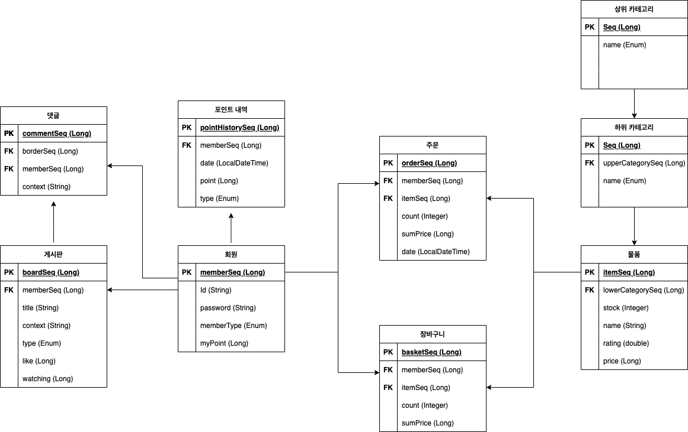

# 클린 아키텍쳐 공부를 위한 토이 프로젝트

## 프로젝트 정보
- 헥사고날 아키텍쳐
- mockito
- JDK 11
- JPA

## 요구사항 List
1. 로그인, 회원가입을 할 수 있어야한다.
2. 회원은 물건을 구매할 수 있다.
3. 회원은 관리자와 고객으로 나뉜다.
4. 물건을 구매할 때 잔여 개수를 확인 할 수 있다.
5. 관리자는 물건에 가격과 잔여 개수를 수정할 수 있다.
6. 물건은 카테고리를 가지고 페이징 처리가 되어야한다.
7. 고객은 물건에 평점을 매길 수 있다.
8. 고객은 물건을 사면 포인트를 받을 수 있다.
9. 고객은 포인트 내역을 조회할 수 있다.
10. 고객은 물건을 사기 전 장바구니를 이용할 수 있다.
11. 포인트를 돈 대신에 사용할 수 있다.
12. 고객은 고객센터 게시판에 글을 남길 수 있고 비밀/공개 처리를 할 수 있다.
13. 고객센터 게시판도 페이징 처리가 되어질 수 있어야한다.
14. 고객센터 게시판에 고객들이 답글을 달 수 있어야한다.
15. 고객센터 게시판에 글마다 고객들이 좋아요를 누를 수 있고 조회수를 확인할 수 있다.

## ORM

